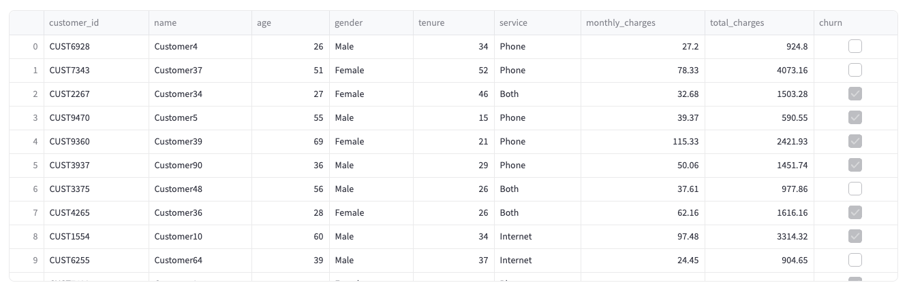
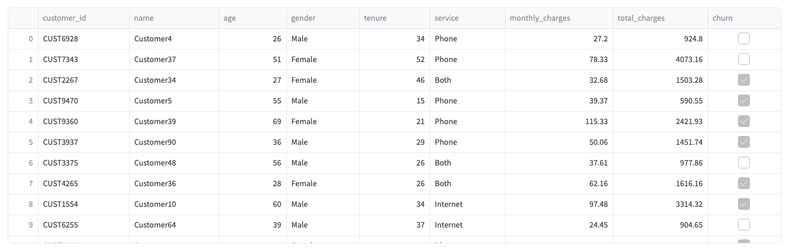
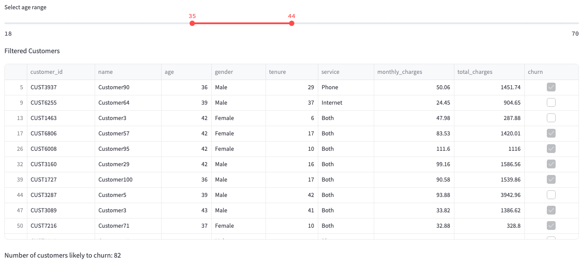
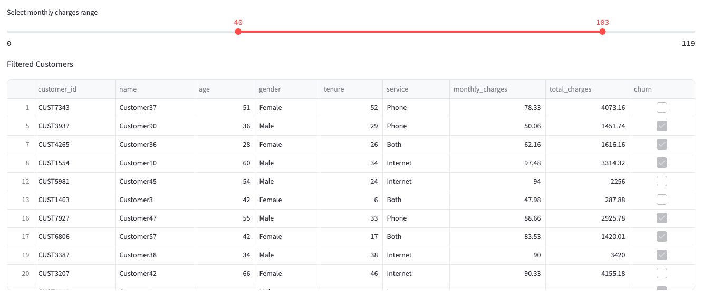
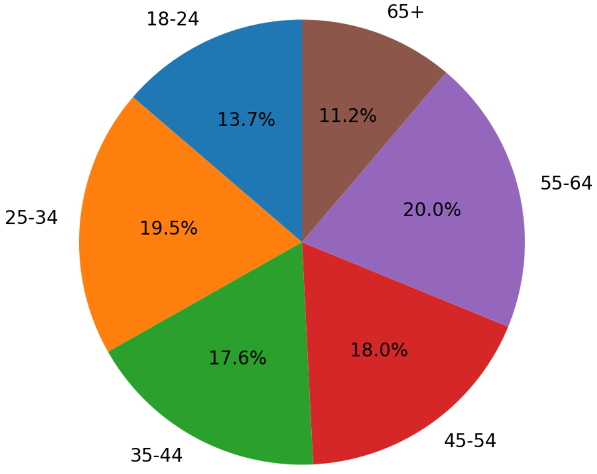
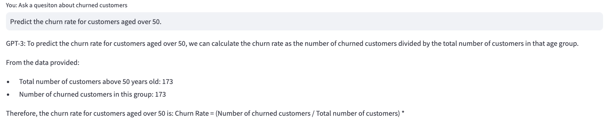

# langchain-snowflake
Snowflake langchain and streamlit


# Telecom Customer Data Analysis

This project analyzes telecom customer data to predict customer churn and visualize customer distribution by age groups.

## Table of Contents

- [Telecom Customer Data](#telecom-customer-data)
- [Churn Analysis](#churn-analysis)
- [Predict Churn Based on Age](#predict-churn-based-on-age)
- [Predict Churn Based on Monthly Charges](#predict-churn-based-on-monthly-charges)
- [Customer Distribution by Age Groups](#customer-distribution-by-age-groups)
- [Setup and Installation](#setup-and-installation)
- [Usage](#usage)

## Telecom Customer Data

The dataset contains information about telecom customers, including their age, gender, tenure, service type, monthly charges, total charges, and whether they have churned.

## Churn Analysis

The churn analysis section displays the customers who have churned.

## Predict Churn Based on Age

This section allows you to filter customers by age range and predict the number of customers likely to churn within that range.

## Predict Churn Based on Monthly Charges

This section allows you to filter customers by monthly charges range and predict the number of customers likely to churn within that range.

## Customer Distribution by Age Groups

This section displays a pie chart showing the distribution of customers across different age groups.

## Example Questions to Ask the Model

- "How many of the customers above 50 will likely churn in the next month?"
- "Predict the churn rate for customers aged over 50."
- "Based on this data, what is the estimated number of churns from customers over 50 in the next quarter?"

Make sure that the prompt you send to the model contains enough context and is clear for prediction tasks. You might also want to include additional details about trends, previous churn rates, or any other relevant data if available.


## Setup and Installation

1. Clone the repository:
    ```sh
    git clone https://github.com/yourusername/telecom-customer-churn.git
    cd telecom-customer-churn
    ```

2. Create a virtual environment and activate it:
    ```sh
    python -m venv venv
    source venv/bin/activate  # On Windows use `venv\Scripts\activate`
    ```

3. Install the required dependencies:
    ```sh
    pip install -r requirements.txt
    ```

4. Create a `.env` file in the root directory and add your OpenAI API key:
    ```plaintext
    OPENAI_API_KEY=your_openai_api_key_here
    ```

## Usage

1. Generate dummy customer data:
    ```sh
    python scripts/generate_dummy_data.py
    ```

2. Load the data into Snowflake (ensure your Snowflake credentials are set in the `.env` file):
    ```sh
    python scripts/load_data_snowflake.py
    ```

3. Run the Streamlit app:
    ```sh
    streamlit run app.py
    ```

4. Open your browser and go to `http://localhost:8501` to interact with the app.

## Example Output

### Telecom Customer Data



### Churn Analysis



### Predict Churn Based on Age



### Predict Churn Based on Monthly Charges



### Customer Distribution by Age Groups



### ChatGPT - User ask a question about churned cutomers 



### ChatGPT - User ask a question about churned cutomers 

 

